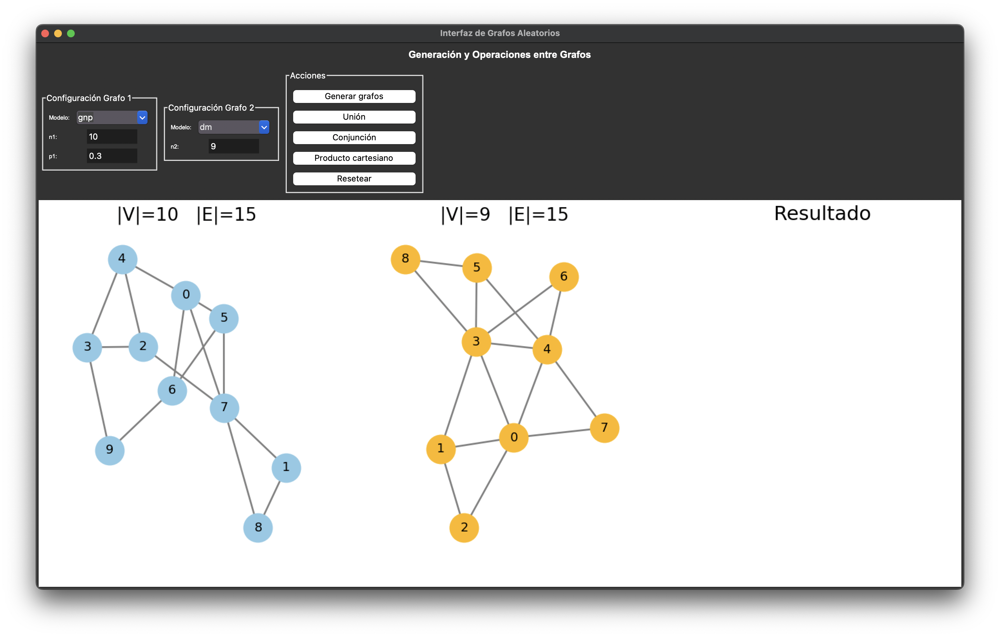
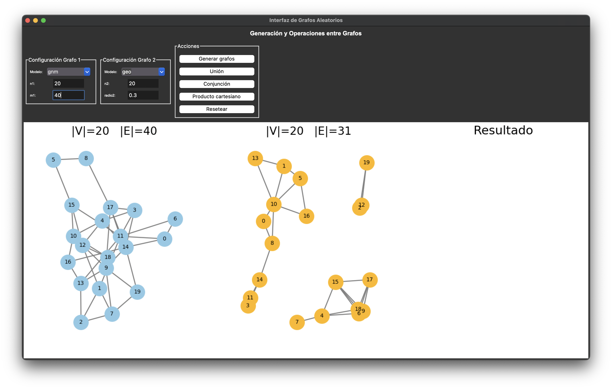
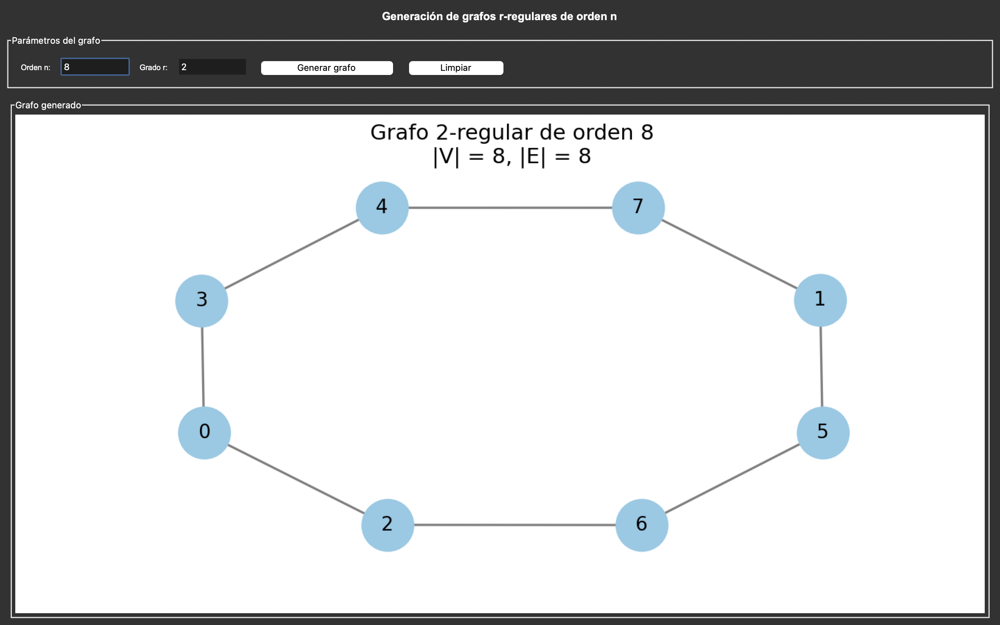
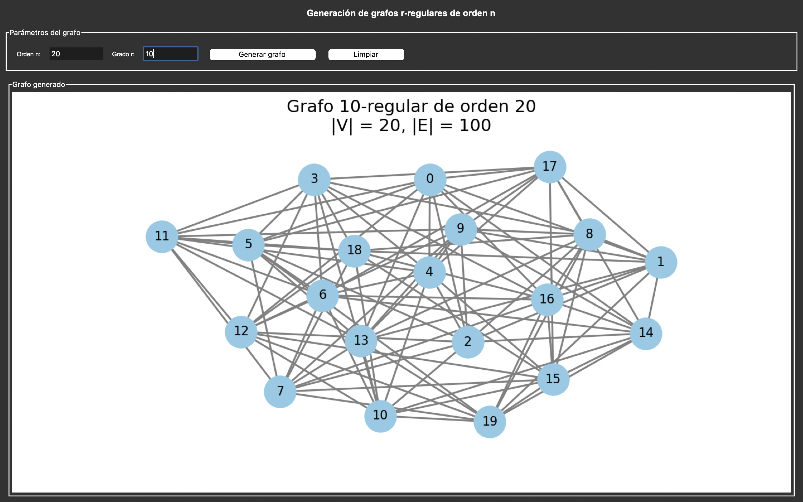
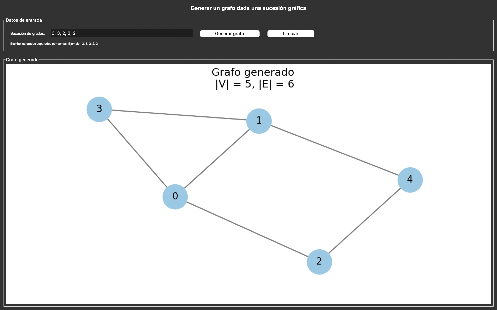
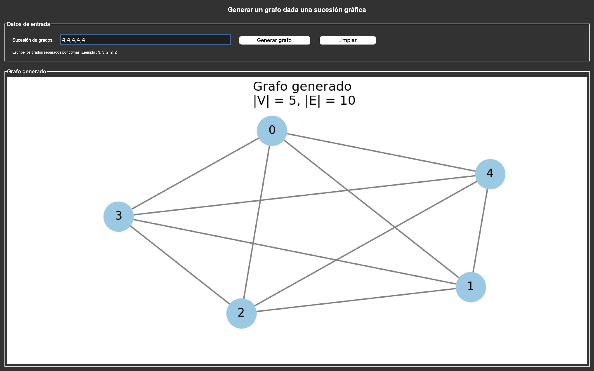
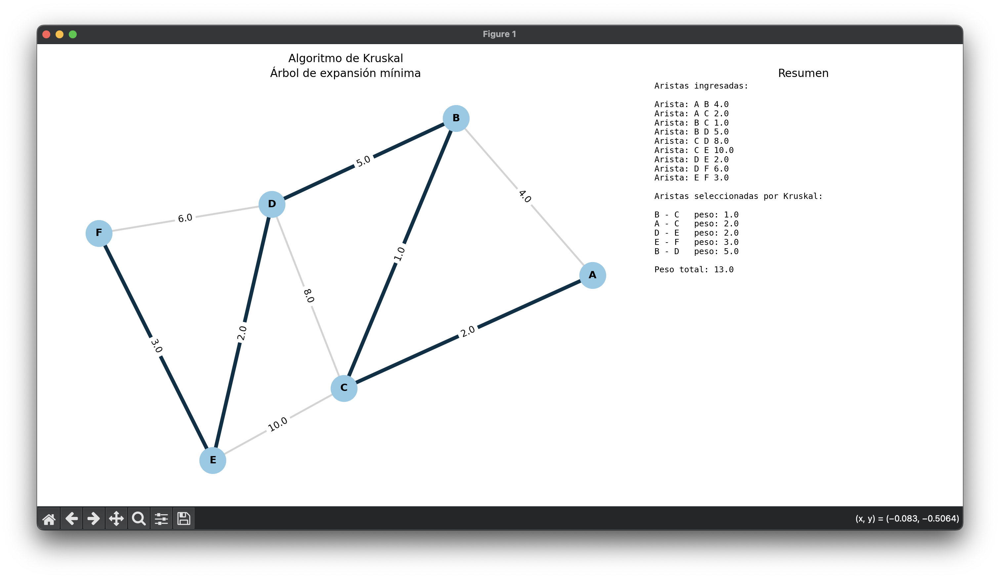
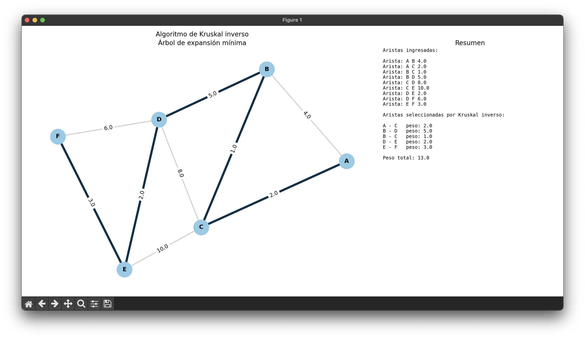
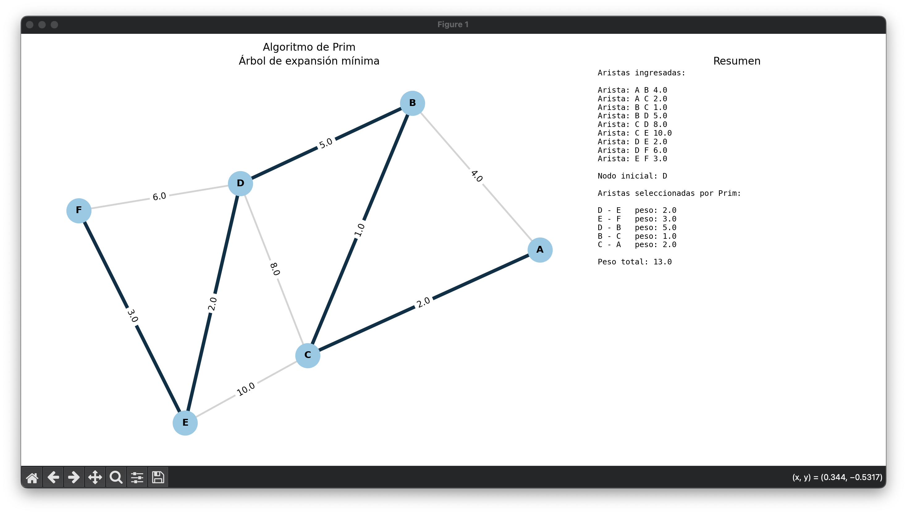

# Graph Theory Random Models

Proyecto  Teoría de Grafos.

Este repositorio contiene implementaciones de algoritmos para la generación, análisis y visualización de grafos.  
Los programas fueron desarrollados usando principalmente `NetworkX`, `Matplotlib` y `Tkinter`.

El proyecto incluye modelos de generación de grafos aleatorios, generación de grafos r-regulares, generación de grafos a partir de una sucesión gráfica y algoritmos para encontrar árboles de expansión mínima.

## Estructura del repositorio

```text
GRAPH-THEORY-RANDOM-MODELS/
│
├── README.md
│
├── src/
│   ├── generacion_grafos.py
│   ├── grafo_regular.py
│   ├── sucesion_grafica.py
│   ├── kruskal.py
│   ├── kruskal_inverso.py
│   └── prim.py
│
└── images/
    ├── generacion_aleatoria.png
    ├── generacion_aleatoria2.png
    ├── grafo_regular_8_2.png
    ├── grafo_regular_20_10.png
    ├── grafo_regular_error.png
    ├── grafo_sucesion_1.png
    ├── grafo_sucesion_2.png
    ├── grafo_sucesion_error.png
    ├── kruskal_1.png
    ├── kruskal_inverso_1.png
    └── prim_1.png
```

---

## Instalación de dependencias

Para ejecutar los programas se deben instalar las siguientes librerías:

```bash
pip install networkx matplotlib
```

---

## Ejecución

Cada algoritmo se encuentra en un archivo independiente dentro de la carpeta `src`.

---

# Algoritmos implementados

## 1. Generación de grafos aleatorios y operaciones entre grafos

En este programa se implementan distintos modelos de generación de grafos:

- Modelo Erdős-Rényi `G(n,m)`
- Modelo de Gilbert `G(n,p)`
- Modelo geográfico simple
- Modelo Dorogovtsev-Mendes

También se implementan operaciones entre grafos:

- Unión
- Conjunción
- Producto cartesiano

El programa cuenta con una interfaz gráfica que permite seleccionar modelos, ingresar los  parámetros y visualizar los grafos que se generaron.

### Ejemplo 1



### Ejemplo 2



---

## 2. Generación de grafos r-regulares de orden n

Un grafo r-regular de orden `n` es un grafo con `n` nodos donde todos los nodos tienen exactamente grado `r`.

El programa permite ingresar:

- el orden `n`,
- el grado regular `r`.

Antes de generar el grafo, se verifican  las condiciones necesarias:

- `n > 0`
- `r >= 0`
- `r < n`
- `n*r` debe ser par

### Ejemplo con n = 8 y r = 2



### Ejemplo con n = 20 y r = 10



### Validación de error

Cuando los parámetros no cumplen las condiciones necesarias, el programa muestra error.


---

## 3. Generar un grafo dada una sucesión gráfica

Este programa genera un grafo simple a partir de una sucesión gráfica usando el algoritmo de Havel-Hakimi.

Una sucesión gráfica es una lista de grados que corresponde a los grados de los nodos de un grafo simple.

El usuario ingresa una sucesión de grados separada por comas, por ejemplo:

```text
3, 3, 2, 2, 2
```

Si la sucesión es gráfica, el programa genera el grafo correspondiente.

### Ejemplo con sucesión 3, 3, 2, 2, 2



### Ejemplo con sucesión 4, 4, 4, 4, 4



### Validación de sucesión no gráfica

Si la sucesión ingresada no es gráfica, el programa muestra  error.


---

## 4. Algoritmo de Kruskal

El algoritmo de Kruskal permite encontrar un árbol de expansión mínima en un grafo ponderado.

El programa solicita al usuario ingresar las aristas del grafo con el siguiente formato:

```text
nodo1 nodo2 peso
```

Ejemplo:

```text
A B 4
A C 2
B C 1
fin
```

El algoritmo ordena las aristas de menor a mayor peso y selecciona aquellas que no forman ciclos, hasta construir el árbol de expansión mínima (MST).

### Resultado



---

## 5. Algoritmo de Kruskal inverso

El algoritmo de Kruskal inverso también obtiene un árbol de expansión mínima, pero trabaja de forma contraria al algoritmo de Kruskal .

En lugar de agregar aristas de menor peso, parte del grafo completo y elimina aristas de mayor peso siempre que el grafo permanezca conectado.

### Resultado



---

## 6. Algoritmo de Prim

El algoritmo de Prim encuentra un árbol de expansión mínima comenzando desde un nodo inicial.

El programa solicita:

- las aristas del grafo,
- los pesos de las aristas,
- un nodo inicial.

A partir de ese nodo el algoritmo selecciona en cada paso la arista de menor peso que conecta el árbol actual con un nuevo nodo.

### Resultado



---

## Autor

Deni Leonardo Torres